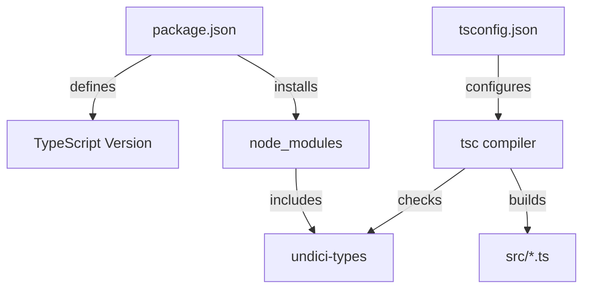

# DESIGN_javascript_build_fix

## 分层设计和核心组件
该任务涉及构建层配置。

### 核心组件: tsconfig.json
- **作用**: 控制 TypeScript 编译器的行为。
- **关键配置**: `skipLibCheck: true` 会使编译器跳过所有声明文件 (`.d.ts`) 的类型检查。这通常用于解决 `node_modules` 中不一致的库类型导致的构建阻塞。

## 依赖关系

## 异常处理策略
- 如果出现 `tsc` 版本过低无法识别 `skipLibCheck`（虽不可能，因为 3.9 支持该属性），则升级 `typescript` 依赖。
