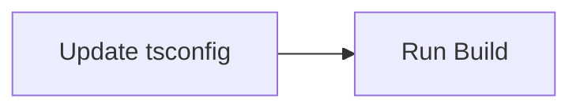

# TASK_javascript_build_fix

## 任务列表
1. **Task 1: Update configuration**
   - **输入**: `javascript/tsconfig.json`
   - **操作**: 添加 `"skipLibCheck": true`
   - **输出**: 修改后的 `tsconfig.json`
   - **验收标准**: 文件格式正确。

2. **Task 2: Execute Build**
   - **输入**: 修改后的环境
   - **操作**: `cd javascript && yarn run build`
   - **输出**: 构建日志和 `dist` 目录
   - **验收标准**: 命令执行成功，无错误输出。

## 依赖图

